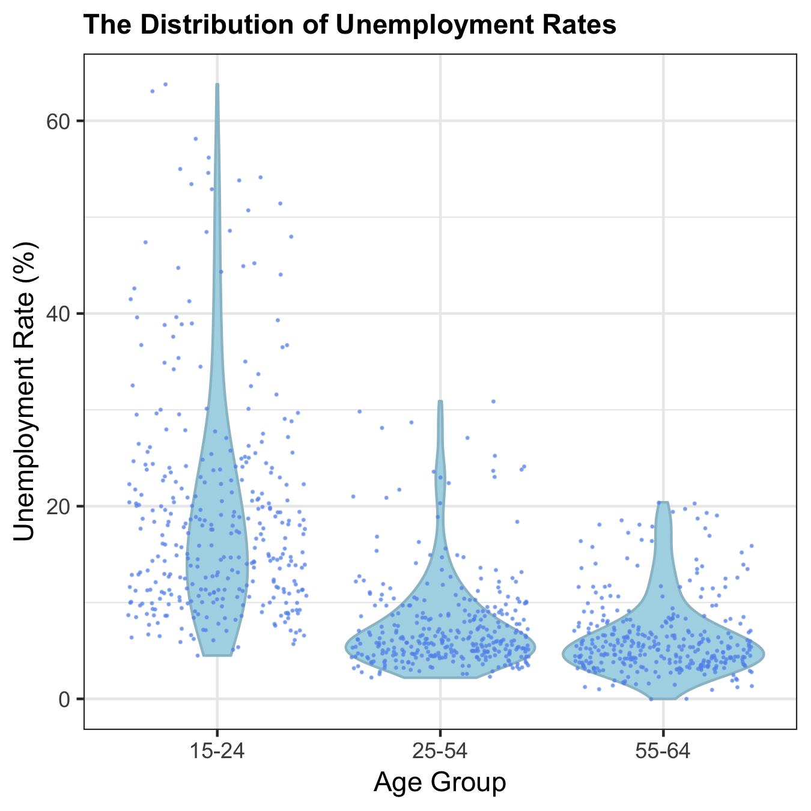
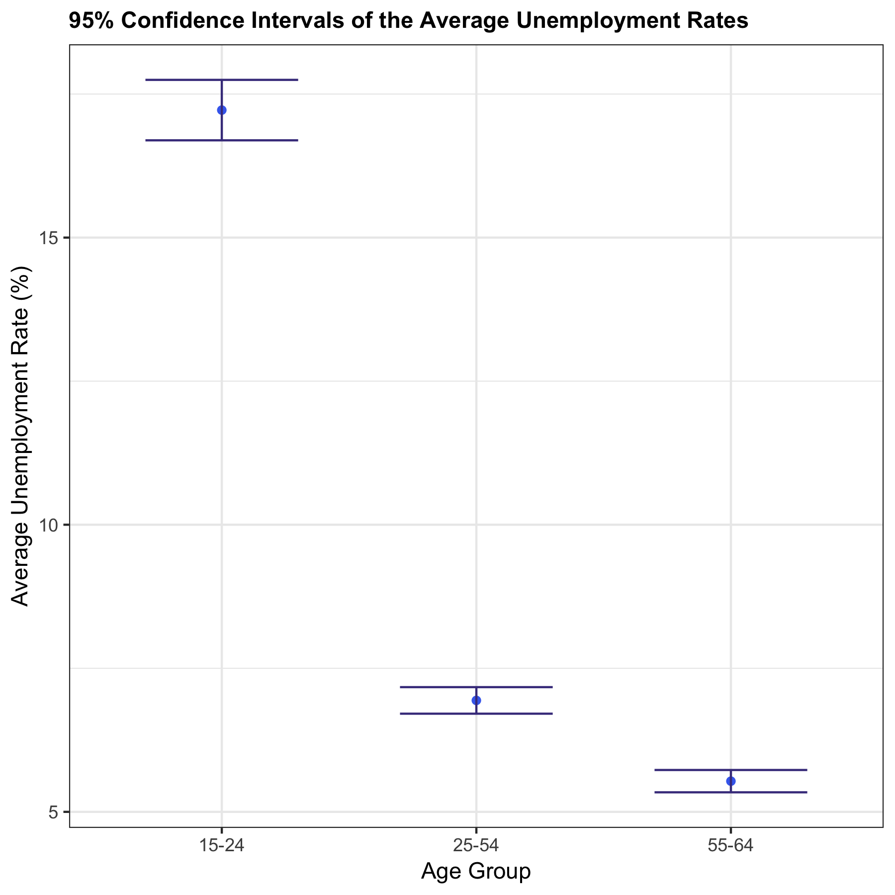

```{r setup, include=FALSE}
knitr::opts_chunk$set(echo = TRUE)
library(tidyverse)
```

# The Relationship Between Unemployment Rate and Age Among Developed Countries 

In a short 7 months, students from the UBC MDS program will be leaving the comfort of school routine and entering the busy job market. Unlike most graduate programs, students enrolled in MDS come from many different countries and backgrounds. One of the beautiful things about this program is the vast age range of the students in the program. This topic of thought brought up the following research question: 

     " For developed countries in the past 5 years, is there a difference in the mean unemployment rates in different age groups?"

Although we hope that every person in this program has a high likelihood of employment once graduated, we were curious if age had an effect on the unemployment rate of a country on a large scale. 

## Dataset 

Our dataset “Employment: Unemployment rate by sex and age group” was obtained from by www.OECD.org. The data was organized by country, year and age group and filtered using only 5 years in the range 2012-2016. The age groups used for this analysis are separated into 3 categories; ages 15-24, 25-54 and 54-64. This was simply chosen because the dataset used was presented in this way. Due to the nature of the question addressing the mean unemployment rates of only developed countries, we omitted developing countries (See Reference #1). One item to note is that male and female unemployment rates for each country and year are taken as 2 separate observations and are viewed as equally important. Below is an example of the clean dataset we based our analysis on and the variables addressed. 


```{r dataset, echo=FALSE}
data <- read.csv("../data/unemployment-age-gender-countries-filtered-clean.csv")
D=head(data)
```

###### Table 1: Dataset used in Age and Unemployment Rate analysis showing variables and examples of observations 
```{r echo=FALSE}
knitr::kable(D)
```


The values of unemployment rates for the different age group vary substantially in distribution. The maximum and minimum unemployment rate of age group 15-24 is 63.8% and 4.5% respectively, with a median unemployment rate of 16.55%. The age group 25-54 has a maximum unemployment of 30.9% a minimum rate of 2.2 with a median of 6.05%. The last age group 55-64 has maximum and minimum values of 20.4% and 0% respectively with a median unemployment rate of 5.4%. To see how much the rates differ in comparison to each individual age group the violin jitter plot is provided below. It is very evident by comparing the shape of the violin plot how much the data for each age group varies. 


```{r echo=FALSE, out.width='70%', fig.width=7,fig.height=6}

```

###### Figure 1: Violin with Overlaying Jitter plots showing how the data is distributed for each age group where each jitter point represents a single observation. 
  

## Findings

To begin the analysis we first must perform ANOVA to answer our hypothesis question " Iis there a difference in the mean unemployment rates in different age groups??".  For this test, our 2 hypotheses are as follows:  

> Null hypothesis: The mean unemployment rates across all age groups are equal.  
>
> Alternative hypothesis: The mean unemployment rates across all age groups are not equal.  

ANOVA produced the following results: 

###### Table 2: ANOVA results for age group and unemployment rates using a critical value of 0.05 

```{r echo= FALSE}
anova <- read.csv("../results/anova-table.csv")
knitr::kable(anova)
```

The table shows a p-value of ~0.0 (1.645731e-102 when calculating).  Using a critical value of 0.05 shows strong evidence to reject the null hypothesis.  This result produces the conclusion that all three age groups mean unemployment rate are not equal.  Although successful in nature, this conclusion does not exactly answer what age groups differ among the three and we must perform further analysis to discover exactly which of the three groups are different from one another. This leads us to pair-wise t-testing. In order to find which age group's mean unemployment rates statistically differ, each pair of age groups must be compared using a t-test and new individual hypotheses.

> Null hypothesis: Age group 1 and age group 2 have equal mean unemployment rates. 
>
> Alternative hypothesis: Age group 1 and age group 2 do not have equal mean unemployment rates.

Evaluating the confidence interval of each group, it is evidence there is little to no overlap between the groups as displayed in figure 2. 

```{r echo=FALSE, out.width='70%', fig.width=7,fig.height=6}

```

###### Figure 2: Mean unemployment rate for age groups 15-24, 25-54, 55-64. Error bars represent 95% confidence intervals generated using Asymptotic Theory. 


Performing 3 separate tests produced the values in Table 3, showing Figure 2 confidence interval predictions correct. 

###### Table 3: Pair-wise T-Test for each age group comparison using a critical value of 0.05 to Reject or fail to Reject the Null hypothesis. 

```{r echo = FALSE}
pair <- read.csv("../results/pairwise-test-table.csv")
knitr::kable(pair)
```

The table above shows that all three t-tests produced p values that are lower than the critical value of 0.05, giving sufficient evidence to reject all 3 null hypotheses.  This translates to all three age groups having statistically different mean unemployment rates from one another.  

## Conclusion:
As much as we hoped that all mean unemployment rates were equal after performing an ANOVA test and followed up with 3 pairwise t-tests, we can confirm quite confidently that all three age groups are not equal and are all different from each other.  One finding that particularly stood out was how much higher the age group 15-24 was when compared to the other 2. This was not a surprise; however, it was not an ideal result in terms of expectations in society.

## Assumptions
In order to apply the ANOVA, we are assuming that the following conditions are satisified. First of all, all of our samples are independent of each other. Secondly, the variances between different age groups are assumed to be equal. thirdly, to be able to use anova and pairwise t-tests we need to assume our data and residuals are normally distributed. 
Lastly, we are assuming that male and female observations are equally important in our studies.

## Limitations
Since the ranges of age groups are already defined in our dataset, we can only perform our analysis with the pre-defined groups. Furthermore, the pairwise t-tests that we conducted in our later analysis often have an increased chance of having a type I error, due to the higher number of t-tests that we are performing. 

## Future Directions:
In the future, we might conduct a similar analysis on a gender-specific basis to see if our data agrees with the claim from other statisticians that the gender unemployment gap exists.(check references #3)
Also, we can extend our current analysis to not only developed countries but also developing countries.
In addition, it would be preferable if we can reproduce the analysis with a finer age group separations.

## References
-    List of Developed Countries
https://en.wikipedia.org/wiki/Developed_country, section: World Bank high-income economies
-    Dataset
https://stats.oecd.org/index.aspx?queryid=54743
-    Gender Unemployment Gap by Stefania Albanesi, Aysegul Sahin
https://voxeu.org/article/gender-unemployment-gap


