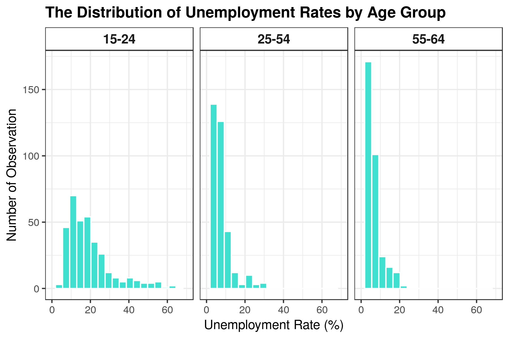

```{r setup, include=FALSE}
knitr::opts_chunk$set(echo = TRUE)
library(tidyverse)
```

# The Relationship Between Unemployment Rate and Age Among Developed Countries 

In a short 7 months, students from the UBC MDS program will be leaving the comfort of school routine and entering the busy job market. Unlike most graduate programs, students enrolled in MDS come from many different countries and backgrounds. One of the beautiful things about this program is the vast age range of the students in the program. This topic of thought brought up the following research question: 

    "Is there a difference in mean unemployment rates of developed countries in different age groups?"

Although we hope that every person in this program has a high likelihood of employment once graduated, we were curious if age had an effect on the unemployment rate of a country on a large scale. 

## Dataset 

Our dataset “Employment: Unemployment rate by sex and age group” was obtained from by www.OECD.org. The data was organized by country, year and age group and filtered using only 5 years in the range 2012-2016. The age groups used for this analysis are separated into 3 categories; ages 15-24, 25-54 and 54-64. This was simply chosen because the dataset used was presented in this way. Due to the nature of the question addressing the mean unemployment rate of only developed countries, we omitted developing countries (See Sources). One item to note is that male and female unemployment rates for each country and year are taken as 2 separate observations. Below is an example of the clean dataset we based our analysis on and the variables addressed. 

###### Table 1: Dataset used in Age and Unemployment Rate Analysis

```{r dataset, echo=FALSE}
data <- read.csv("../data/unemployment-age-gender-countries-filtered-clean.csv")
head(data)

young <- data %>% filter(Age.Group == "15-24") 
med <- data %>% filter(Age.Group == "25-54") 
old <- data %>% filter(Age.Group == "55-64") 

```

The values of unemployment rates for the different age group vary substantially in distribution. The maximum and minimum unemployment rate of age group 15-24 is 63.8% and 4.5% respectively, with a median unemployment rate of 16.55%. The age group 25-54 has a maximum unemployment of 30.9% a minimum rate of 2.2 with a median of 6.05%. The last age group 55-64 has maximum and minimum values of 20.4% and 0% respectively with a median unemployment rate of 5.4%. This can be seen more directly in the histogram below

###### Figure 1: histograms of age group unemployment rates 



To see how much the rates differ in comparison to each individual age group the violin jitter plot is provided below. 

###### Figure 2: Violin with Overlaying Jitter plots 


## Analysis

To begin the analysis we first must perform ANOVA to answer our hypothesis question "Is there a difference in mean unemployment rates of developed countries in different age groups?".  For this test, our 2 hypotheses are as follows:  

Null hypothesis: The mean unemployment rates across all age groups are equal.  
Alternative hypothesis: The mean unemployment rates across all age groups are not equal.  

ANOVA produced the following results: 

###### Table 2: ANOVA results for Age Group and unemployment rates. 

```{r echo= FALSE}
anova <- read.csv("../results/anova-table.csv")
anova

```

The table shows a p-value of 1.645731e-102 and using a critical value of 0.05 this shows strong evidence to reject the null hypothesis.  This produces the conclusion that all three age groups mean unemployment rate are not equal.  Although successful in nature, this conclusion does not exactly answer what age group differs and we must perform further analysis to discover exactly which of the three groups differ from one another. This leads us to pair-wise t-testing. In order to find which age group's mean unemployment rate statistically differ, each pair of age groups must be compared using a t-test and new individual hypotheses.

Null hypothesis: Age group 1 and age group 2 have equal mean unemployment rates.   
Alternative hypothesis: Age group 1 and age group 2 do not have equal mean unemployment rates.

Evaluating the confidence interval of each group, it is evidence there is little to no overlap between the groups as displayed in figure 3. 

###### Figure 3: Confidence Intervals of Mean Unemployment Rates of the 3 Age Groups. 


Performing 3 separate tests produced the values in Table 3. 

###### Table 3: Pair-wise T-Test for Each Pair of Age Groups. 

```{r echo = FALSE}
pair <- read.csv("../results/pairwise-test-table.csv")
pair
```


The table above shows that all three t-tests produced p values that are lower than the critical value of 0.05, giving sufficient evidence to reject all 3 null hypotheses.  This translates that all three age groups have statistically different mean unemployment rates from one another.  


