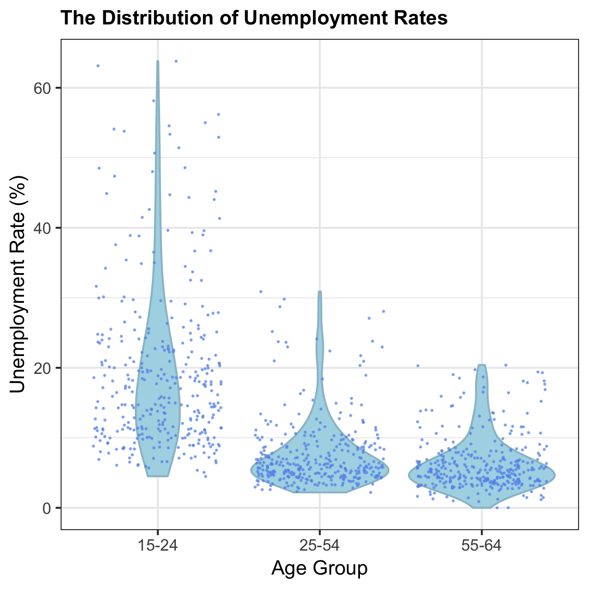

```{r setup, include=FALSE}
knitr::opts_chunk$set(echo = TRUE)
library(tidyverse)
```

# The Relationship Between Unemployment Rate and Age Among Developed Countries 

In a short 7 months, students from the UBC MDS program will be leaving the comfort of school routine and entering the busy job market. Unlike most graduate programs, students enrolled in MDS come from many different countries and backgrounds. One of the beautiful things about this program is the vast age range of the students in the program. This topic of thought brought up the following research question: 

    "Is there a difference in mean unemployment rates of developed countries in different age groups?"

Although we hope that every person in this program has a high likelihood of employment once graduated, we were curious if age had an effect on the unemployment rate of a country on a large scale. 

## Dataset 

Our dataset “Employment: Unemployment rate by sex and age group” was obtained from by www.OECD.org. The data was organized by country, year and age group and filtered using only 5 years in the range 2012-2016. The age groups used for this analysis are separated into 3 categories; ages 15-24, 25-54 and 54-64. This was simply chosen because the dataset used was presented in this way. Due to the nature of the question addressing the mean unemployment rate of only developed countries, we omitted developing countries (See Sources). One item to note is that male and female unemployment rates for each country and year are taken as 2 separate observations. Below is an example of the clean dataset we based our analysis on and the variables addressed. 

###### Table 1: Dataset used in Age and Unemployment Rate Analysis

```{r dataset, echo=FALSE}
data <- read.csv("../data/unemployment-age-gender-countries-filtered-clean.csv")
head(data)
```

The values of unemployment rates for different countries, gender and year differed substantially with a maximum value of 63.8% and a minimum of 0%. The mean unemployment rate of the entire data is 11.09% with a median of 7.75%. This can be seen more directly in the histogram below. 

###### Figure 1: histograms of age group unemployment rates 


###### Figure 2: Violin with Overlaying Jitter plots 



